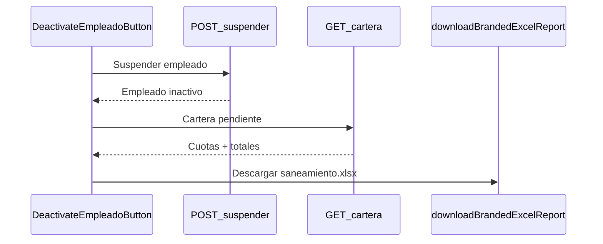

# Documento de cartera al suspender empleado

## Enfoque

Al confirmar **Suspender** en [DeactivateEmpleadoButton.tsx](src/features/employer-panel/ui/DeactivateEmpleadoButton.tsx):

1. Se suspende al empleado (`POST /empleados/{id}/suspender/`).
2. Se consulta la cartera pendiente real (`GET /empleados/{id}/cartera-pendiente/`).
3. Se descarga un Excel corporativo (mismo estilo que retenciones/nómina vía `downloadBrandedExcelReport`) con el detalle de deudas para descuento.

**Formato:** Excel `.xlsx` (no PDF). Encaja con los reportes del empleador y es usable por nómina/RRHH.

**Qué cuenta como deuda:** cuotas con `estado = pendiente` de solicitudes ya **pagadas** (`estado = pagado`) del empleado en esa empresa. No se incluyen solicitudes solo aprobadas o en revisión (aún no desembolsadas).



## Backend

Repo: `adebackend/Adelantos/cerebiia-adelantos-backend`

### 1. Repositorio de cuotas

En [django_cuota_repository.py](c:/Users/yilgr/OneDrive/Desktop/adebackend/Adelantos/cerebiia-adelantos-backend/src/apps/adelantos/infrastructure/persistence/repositories/django_cuota_repository.py) (y contrato ABC), agregar:

`find_cuotas_pendientes_empleado(empresa_id, empleado_id)` — filtro análogo a `find_descuentos_nomina_periodo`, pero sin rango de fechas y solo `cuota.estado = pendiente` + `solicitud.estado = pagado`.

Campos por fila: `cuota_id`, `solicitud_id`, `cuota_numero`, `cuota_monto`, `tarifa_cuota`, `fecha_corte`, `monto_solicitud`, `monto_neto`, `tarifa_total`, `numero_cuotas_total`, `pagado_en`, datos del empleado.

### 2. Use case + DTO + endpoint

- Use case (en `empleados` o `adelantos`): valida que el empleado pertenezca a la empresa autenticada; arma totales.
- Respuesta JSON:

```json
{
  "empleado": { "id", "nombre", "documento", "salario", "estado" },
  "generado_en": "...",
  "cuotas_pendientes": [ /* filas */ ],
  "totales": {
    "cantidad_cuotas": 0,
    "total_capital": "0.00",
    "total_tarifas": "0.00",
    "total_a_descontar": "0.00"
  }
}
```

`total_a_descontar` = suma de `cuota_monto + tarifa_cuota` (lo que debe sanearse en nómina).

- Ruta: `GET /empleados/<uuid:empleado_id>/cartera-pendiente/` con `IsEmpresa`, junto a suspender en [urls.py](c:/Users/yilgr/OneDrive/Desktop/adebackend/Adelantos/cerebiia-adelantos-backend/src/apps/empleados/infrastructure/api/urls.py).
- Test e2e mínimo: empleado con cuotas pendientes → 200 con totales; empleado ajeno → 404.

## Frontend

Repo: `cerebiia-adelantos-frontend`

### 1. API + tipos

- Tipo `CarteraPendienteEmpleadoDTO` en [empleado.ts](src/shared/api/types/empleado.ts) (o archivo dedicado).
- Método `empleadosEndpoints.carteraPendiente(empleadoId)` en [empleados.ts](src/shared/api/endpoints/empleados.ts).

### 2. Generador Excel (agnóstico)

Nuevo helper en `src/shared/lib/empleadoCarteraReport.ts` usando [excelReport.ts](src/shared/lib/excelReport.ts):

- Filename: `cartera-saneamiento-{documento}-{YYYYMMDD}.xlsx`
- Hoja con columnas: Documento, Empleado, ID solicitud, Cuota #, Monto cuota, Tarifa, Fecha corte, Monto adelanto, Neto, Fecha desembolso, Total fila
- Footer: totales (capital, tarifas, **total a descontar**)
- Si no hay cuotas: hoja con datos del empleado + fila “Sin deuda pendiente / cartera saneada”

### 3. UX en suspensión

Actualizar [DeactivateEmpleadoButton.tsx](src/features/employer-panel/ui/DeactivateEmpleadoButton.tsx):

- Al abrir el diálogo de suspender: precargar cartera y mostrar resumen (`X cuotas · $total a descontar`) en la descripción.
- Tras suspender OK: generar y descargar el Excel; toast: “Empleado suspendido. Se descargó el documento de cartera.”
- Si la cartera falla tras suspender: toast de advertencia (suspensión ya hecha) sin bloquear.
- Reactivar: sin cambios (no genera documento).

### 4. Tests

- Unit del builder Excel / totales (números a partir de DTO mock).
- Ajuste menor del flujo del botón si hay test existente; si no, cubrir el helper de reporte.

## Fuera de alcance

- No se cambia el estado de las cuotas al suspender (solo documento informativo/operativo).
- No se genera PDF.
- No se altera el overlay localStorage de desactivación legado.