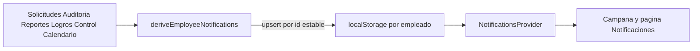

# Notificaciones panel empleado

## Contexto

Hoy el sistema es local y casi vacío: solo existe `advance_requested` en [`src/entities/notification/model/types.ts`](src/entities/notification/model/types.ts), y el flujo real de solicitudes **no escribe** notificaciones. La campana y [`Notificaciones.tsx`](src/pages/Notificaciones.tsx) ya existen; hay que alimentarlas.

**Decisión:** derivar eventos en el cliente desde datos que ya se consultan (solicitudes, auditoría, reportes, logros, Control, calendario de nómina). Persistencia por empleado + IDs leídos en `localStorage`. Sin cambios de backend en este alcance.

## Eventos a implementar (empleado)

| Kind | Disparador | Fuente |
|------|------------|--------|
| `advance_approved` | Adelanto pasa a `aprobado` | `listSolicitudes` |
| `advance_paid` | Adelanto pasa a `pagado` | `listSolicitudes` |
| `advance_rejected` | Adelanto `rechazado` | `listSolicitudes` |
| `payment_evidence` | Aparece `comprobante_pago_url` / evidencia | misma solicitud |
| `payroll_due_3d` | Faltan ≤3 días para el próximo pago de nómina | [`payrollCalendar.ts`](src/shared/config/payrollCalendar.ts) |
| `next_payment_net_updated` | Cambia el próximo pago neto (Control) | [`useEmployeeControlData`](src/features/control/model/useEmployeeControlData.ts) + snapshot previo |
| `cupo_80` | Uso de cupo ≥ 80% en el mes | mismo cálculo de Control |
| `achievement_unlocked` | Nueva insignia desbloqueada | [`useEmployeeAchievements`](src/features/achievements/model/useEmployeeAchievements.ts) |
| `data_change_audit` | Cambio de datos (empresa o el mismo usuario) | `listAuditoriaCambiosMe` |
| `support_replied` | Reporte respondido/resuelto | `listReportesDatoIncorrectoMe` |

`advance_requested` se mantiene por compatibilidad; opcionalmente también se deriva al crear solicitud si el historial ya la incluye.

## Arquitectura

### Capa dominio (agnóstica) — [`src/entities/notification/`](src/entities/notification/)

- Ampliar `NotificationKind` y builders con título/descripción en español.
- IDs estables (no duplicar al refrescar), p. ej.:
  - `advance-approved:{solicitudId}`
  - `advance-paid:{solicitudId}`
  - `advance-rejected:{solicitudId}`
  - `payment-evidence:{solicitudId}`
  - `payroll-due-3d:{YYYY-MM-DD}`
  - `next-payment-net:{monthKey}:{amount}`
  - `cupo-80:{monthKey}`
  - `achievement:{achievementId}`
  - `audit:{cambioId}`
  - `support-replied:{reporteId}`
- Función pura `deriveEmployeeNotifications(input) → StoredNotification[]` que, dado un snapshot de datos + estado previo (último neto, etc.), produce candidatos.
- `upsertEmployeeNotifications(employeeId, candidates)` en storage: inserta solo IDs nuevos; ordena por `createdAt` desc.

### Feature — [`src/features/notifications/`](src/features/notifications/)

- Hook `useSyncEmployeeNotifications`: con sesión empleado + `env.apiUrl`, consulta en paralelo (TanStack Query o reutiliza keys existentes):
  - solicitudes, auditoría me, reportes me, achievements, dashboard/control inputs
- Al resolver datos, llama a `derive` + `upsert` y dispara el refresh del provider (mismo patrón `subscribeEmployeeNotifications`).
- Ampliar [`mapStoredNotifications.ts`](src/features/notifications/model/mapStoredNotifications.ts) con iconos Lucide por kind (Zap, CheckCircle2, XCircle, FileCheck, Calendar, Wallet, AlertTriangle, Trophy, UserCog, MessageSquare).
- Sustituir dependencia de `DemoNotification` / `DEMO_NOTIFICATIONS` por un tipo UI propio (`AppNotification`) en la feature o entity; actualizar [`NotificationItem`](src/components/header/NotificationItem.tsx), panel y página.
- Read state: mantener Set de IDs leídos, **scoped por empleado** (`cerebiia:read-notification-ids:{employeeId}`) para no mezclar cuentas.

### Deep links al hacer click (campana / lista)

| Kind | Destino |
|------|---------|
| Adelanto aprobado/pagado/rechazado/evidencia | Mis adelantos / detalle si existe |
| Nómina 3 días / neto / cupo 80% | `/control` |
| Logro | `/logros#logro-{id}` |
| Auditoría | página auditorías empleado |
| Soporte respondido | página soportes empleado |

Usar `ROUTES` de [`src/shared/config/routes.ts`](src/shared/config/routes.ts).

## Reglas de negocio concretas

- **Aprobado / pagado / rechazado:** una notificación por transición (id con estado); si está `pagado`, no hace falta duplicar “aprobado” histórico al sincronizar por primera vez si preferimos solo el estado actual — se notificará el estado presente la primera vez que el cliente vea esa solicitud (aceptable sin backend de eventos).
- **Evidencia:** solo si hay URL de comprobante y kind distinto de pagado (o además de pagado, según copy: “Te enviaron la evidencia de transferencia”).
- **3 días para pago:** si `daysUntilNextPayroll <= 3` y `>= 0`, emitir una vez por fecha de pago.
- **Próximo pago neto:** comparar con valor guardado en `localStorage`; si cambia y hay deducciones/adelantos, notificar; actualizar snapshot.
- **Cupo 80%:** una vez por mes calendario (`monthKey`) cuando `usedPercent >= 80`.
- **Logro:** por cada `achievementId` unlocked no notificado antes.
- **Auditoría:** todos los cambios nuevos del listado me (empresa y propio), copy según `actor_tipo`.
- **Soporte:** cuando `estado` ∈ `respondido | resuelto` (o hay `respondido_en`).

## Tests

- Unit: builders + `deriveEmployeeNotifications` (cada kind, IDs estables, no duplicar).
- Provider/sync: con fixtures, upsert + markAsRead.
- No E2E obligatorio en este alcance.

## Fuera de alcance

- Panel empresa / notificaciones empleador.
- API backend de notificaciones / push / email.
- Logros del catálogo que aún no se desbloquean (`control_total`, etc.).
